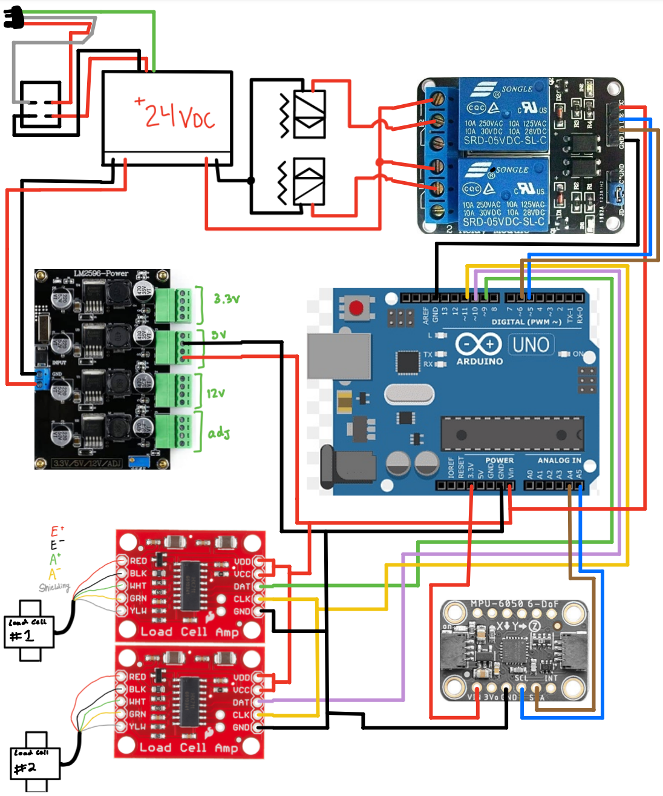
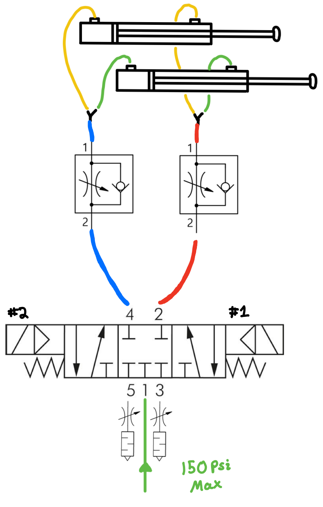
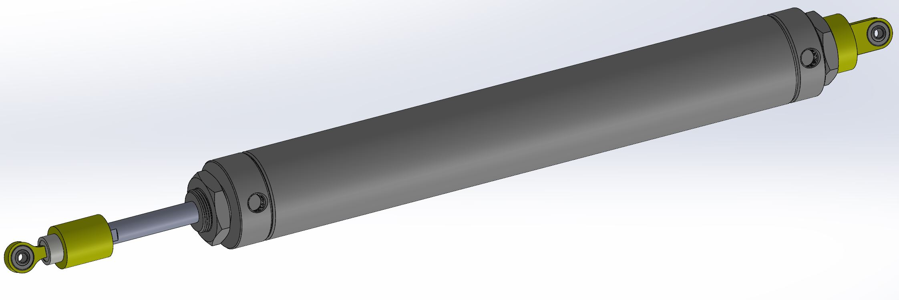
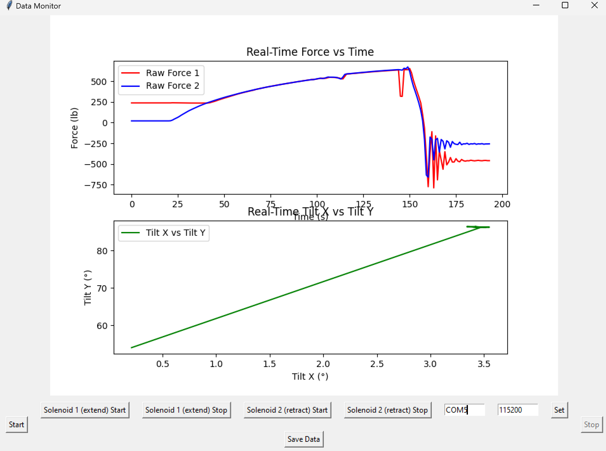
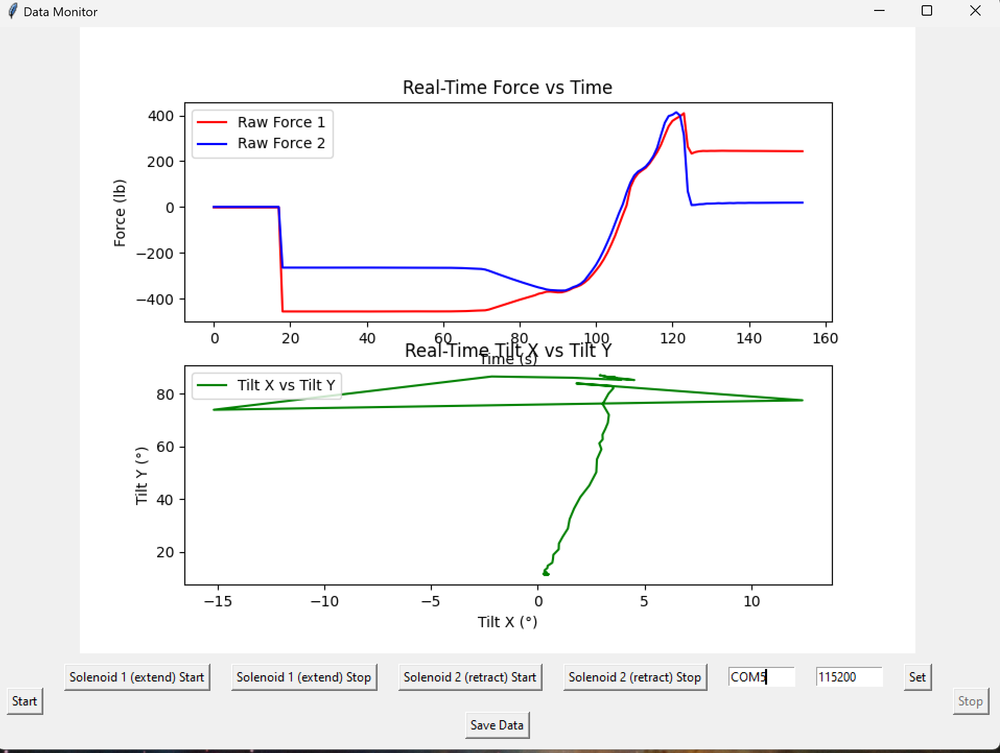
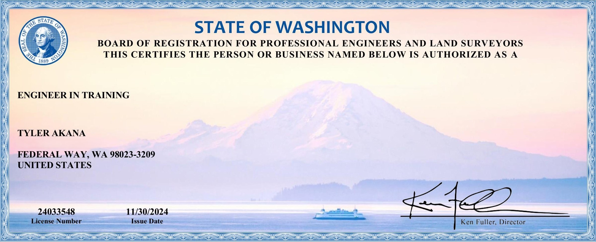

# **Tyler's Portfolio**
#### **Prominent Skills**: CAD, HVAC, Pneumatics, Prototyping Design, Data Analysis, Technical Communication  

---

## **Education**
### **BS, Mechanical Engineering** | *Washington State University* (December 2024)

---

## **Work Experience**

### **Undergraduate Researcher @ Washington State University** | Feb - Dec 2024
#### **Project Goal**: 
  To design a set of temperature-controlled open lid boxes for study of climate change-induced heatwaves on potato growth.
  
#### **Solution Overview**:
  Combined dryer heating elements, centrifugal duct fans, and Arduino-controlled systems to regulate voltage and maintain temperature.

  

    
    
Early Prototype

  

  

    
    
Controls System (excluding servo for variac voltage control)

  

  

    
    
Final Design

  

### **Field-Deployed Problems & Solutions**

  

    

      
      
<strong>Problem:</strong> High current draw caused solder joints to overheat and disconnect wiring.

    

    

      
      
<strong>Solution:</strong> New power supply supports higher peak and continuous current draw.

    

  

  

    

      
      
<strong>Problem:</strong> Thermocouples reported erroneous readings due to polarity issues and board heating.

    

    

      
      
<strong>Solution:</strong> RTD sensors provided accurate readings, enabling better voltage control.

    

  

  

    

      
      
<strong>Problem:</strong> Uneven temperature distribution visually identified by wilting foliage.

    

    

      
      
<strong>Solution:</strong> Redesigned airflow system using PVC pipes ensured even temperature.

    

  

### **Research Outcomes**

  

    
    
Heat box was activated 70 days after planting and remained operational until day 87.

  

  

    
    
Maintained at least 5°C above ambient average temperature; RTD sensors were pending installation.

  

---

## **Kenworth-PACCAR Senior Design Project** | Aug - Dec 2024
#### **Problem**  
W990 Hood Struts are sized inaccurately, not providing enough assistance for initial hood lift-off. Struts were originally based on simulation solutions which are reported to be inaccurate. 

#### **Solution**  
Utilize pneumatic cylinders to push the hood open and closed, and measure force at strut locations using load cells in line with the cylinder. This solution provides an experimental value that can be used to size a spring pack for a better-sized W990 mechanical strut.

#### **System Diagrams**

  

    
    
<strong>Controls System:</strong> Handles pneumatics and load cell data processing.

  

  

    
    
<strong>Pneumatic System:</strong> Configures airflow to dual-action cylinders.

  

### **Cylinder Components**

  
  
Components adapting cylinder and load cell to strut mounts.

### **Test Rig**

  <video width="80%" controls muted>
    <source src="assets/img/Kenworth/TestRig.mp4" type="video/mp4">
    Your browser does not support the video tag.
  </video>
  
Test rig replicating strut mounting positions (sped up 4x).

### **Final Validation**

  <video width="80%" controls muted>
    <source src="assets/img/Kenworth/Extension.mp4" type="video/mp4">
    Your browser does not support the video tag.
  </video>
  
Hood Extension

  <video width="80%" controls muted>
    <source src="assets/img/Kenworth/Retraction.mp4" type="video/mp4">
    Your browser does not support the video tag.
  </video>
  
Hood Retraction

### **Data From Final Tests**

  

    
    
Extension Force Graph

  

  

    
    
Retraction Force Graph

  

---

## **Certifications**
- Engineer In Training (EIT)
  

  
  
*Removed adress from certificate*

---

